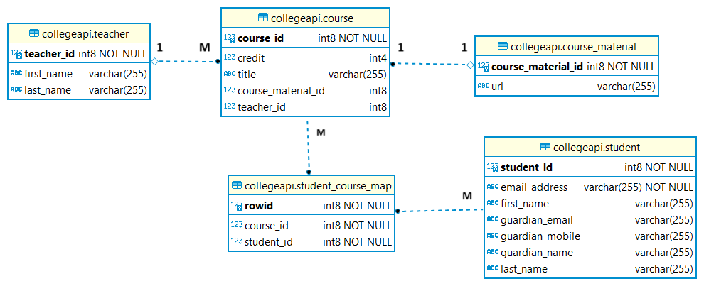

# README - CollegeAPI-JPA


### Introduction

In this project, I went through various important and powerful annotations and methods of Spring Data JPA. This project is a personal hands on example on Spring JPA Framework in Depth. This is a JPA based API project for college which demonstrates in depth practive of Spring Data JPA.


### Dependencies used in Spring Boot

- PostgreSQL Driver 
- Spring Web
- Lombok
- Spring Data JPA


### Database

#### Tables and Mappings

- 5 tables - tbl_student, tbl_course, student_course_map, teacher, course_material

- Course and CourseMaterial is One to One Relationship. For one course, there will be one Course Material and vice versa.
- One Teacher can taught many Courses  (OneToMany Relationship)
- Similarlarly Many courses can be taught by one teacher (ManyToOne Relationship)
- Many Student can opt for many courses available ((ManyToMany Relationship))


#### Database ER Diagram




### Annotations used

```java
@SpringBootApplication
@SpringBootTest
@Repository
@Autowired
@Test

@Entity
@Data // Lombok will generate Getter and Setters with this annotation
@AllArgsConstructor //Lombok will generate @AllArgsConstructor
@NoArgsConstructor //Lombok will generate @NoArgsConstructor
@Builder //Used to test easily
@Table //Table name will be created with name tbl_student.
@Column

@Id // primary key
@SequenceGenerator //This will generate required generator
@GeneratedValue // This will assign Generated Value of student_sequence into studentId
@Embedded // Embedding guardain into here.
@Embeddable // Mentioning  Spring so that Guardian can be embeddable in Student class.
@AttributeOverrides({  // This will take "name" column and insert in table with "guardain_name" column name
	@AttributeOverride(
			name = "name",
			column = @Column(name = "guardain_name")
	)})

@OneToOne
@JoinColumn // foreign key
@ManyToOne
@ManyToMany
@JoinTable // used to create student_course_map for ManyToMany mapping

@Query // JPQL, Native SQL Query and Query with named Parameter
@Modifying // Make this method to modify value in database
@Transactional // Transaction is created -> operations insert/update is done -> transaction committed
@Param // Named Param - :<parameter_name>, which needs to declared by @Param("parameter_name") tag for each parameters
```


### New Course Save log with all entity save
```log
Hibernate: select teacher0_.teacher_id as teacher_1_4_, teacher0_.first_name as first_na2_4_, teacher0_.last_name as last_nam3_4_ from collegeapi.teacher teacher0_
Hibernate: select coursemate0_.course_material_id as course_m1_1_0_, coursemate0_.url as url2_1_0_ from collegeapi.course_material coursemate0_ where coursemate0_.course_material_id=?
2024-02-13 00:29:58.918  INFO 8988 --- [nio-8080-exec-2] c.s.c.service.impl.CourseServiceImpl     : courseMaterialEntity fetched = CourseMaterial(courseMaterialId=null, url=https://developer.demo.com/)
Hibernate: select teacher0_.teacher_id as teacher_1_4_0_, teacher0_.first_name as first_na2_4_0_, teacher0_.last_name as last_nam3_4_0_ from collegeapi.teacher teacher0_ where teacher0_.teacher_id=?
2024-02-13 00:29:59.000  INFO 8988 --- [nio-8080-exec-2] c.s.c.service.impl.CourseServiceImpl     : teacherEntity fetched = Teacher(teacherId=null, firstName=Swarnadeep, lastName=2)
Hibernate: select student0_.student_id as student_1_2_0_, student0_.email_address as email_ad2_2_0_, student0_.first_name as first_na3_2_0_, student0_.guardian_email as guardian4_2_0_, student0_.guardian_mobile as guardian5_2_0_, student0_.guardian_name as guardian6_2_0_, student0_.last_name as last_nam7_2_0_ from collegeapi.student student0_ where student0_.student_id=?
2024-02-13 00:29:59.086  INFO 8988 --- [nio-8080-exec-2] c.s.c.service.impl.CourseServiceImpl     : Student not found in DB
2024-02-13 00:29:59.086  INFO 8988 --- [nio-8080-exec-2] c.s.c.service.impl.CourseServiceImpl     : students fetched = [Student(studentId=0, firstName=Swarnadeep , lastName=Ghosh, emailId=swarnadeep@demo.com, guardain=Guardian(name=Demo Demo, email=test@test.com, mobile=9012345628))]
2024-02-13 00:29:59.086  INFO 8988 --- [nio-8080-exec-2] c.s.c.service.impl.CourseServiceImpl     : Going to save CourseEntity= Course(courseId=null, title=Django, credit=87, courseMaterial=CourseMaterial(courseMaterialId=null, url=https://developer.demo.com/), teacher=Teacher(teacherId=null, firstName=Swarnadeep, lastName=2), students=[Student(studentId=0, firstName=Swarnadeep , lastName=Ghosh, emailId=swarnadeep@demo.com, guardain=Guardian(name=Demo Demo, email=test@test.com, mobile=9012345628))])
Hibernate: select nextval ('collegeapi.course_seq')
Hibernate: select nextval ('collegeapi.course_material_seq')
Hibernate: select nextval ('collegeapi.teacher_seq')
Hibernate: select nextval ('collegeapi.student_seq')
Hibernate: insert into collegeapi.course_material (url, course_material_id) values (?, ?)
Hibernate: insert into collegeapi.teacher (first_name, last_name, teacher_id) values (?, ?, ?)
Hibernate: insert into collegeapi.course (course_material_id, credit, teacher_id, title, course_id) values (?, ?, ?, ?, ?)
Hibernate: insert into collegeapi.student (email_address, first_name, guardian_email, guardian_mobile, guardian_name, last_name, student_id) values (?, ?, ?, ?, ?, ?, ?)
Hibernate: insert into collegeapi.student_course_map (course_id, student_id) values (?, ?)
```
